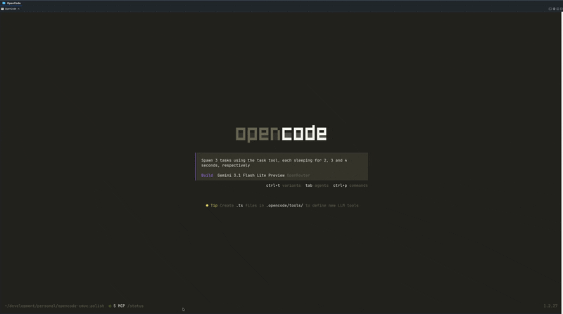

# opencode-cmux



An [OpenCode](https://opencode.ai) plugin that integrates with [cmux](https://github.com/nicholasgasior/cmux) to give you visibility into subagent sessions running in your terminal.

When OpenCode runs inside cmux, subagent sessions automatically get their own TUI pane so you can see what agents are doing without any manual setup.

> **macOS only** — cmux is a macOS terminal multiplexer.

---

## Get started

Add the plugin to your OpenCode config. For global registration (all projects), edit `~/.config/opencode/opencode.json`:

```json
{
  "plugin": [
    "@mspiegel31/opencode-cmux"
  ]
}
```

For project-level registration only, create or edit `opencode.json` in your project root with the same content.

OpenCode installs the plugin automatically at startup — no `npm install` required.

---

## Configuration

Per-plugin config lives at `~/.config/opencode/opencode-cmux.jsonc`. The file is created the first time you run OpenCode inside a cmux session.

```json
{
  "$schema": "https://mspiegel31.github.io/opencode-cmux/schema.json",
  "notify": {
    "sessionDone": true,
    "sessionError": true,
    "permissionRequest": true,
    "question": true
  },
  "sidebar": {
    "enabled": true
  },
  "cmuxSubagentViewer": {
    "enabled": true
  }
}
```

The `notify` object controls granular desktop notification settings for different event types. Set any option to `false` to disable that specific notification. The `sidebar` section controls the cmux status bar integration, and `cmuxSubagentViewer` enables the automatic TUI pane viewer for subagent sessions.

---

## Reference

### Plugins

#### CmuxPlugin

Sends a cmux notification when an OpenCode session goes idle or hits an error, and injects a cmux CLI reference hint into your first TUI prompt.

Only active inside a cmux session.

#### CmuxSubagentViewer

Automatically opens a new cmux split pane running `opencode attach` for each subagent session spawned by the Task tool. The pane closes automatically when the subagent completes or errors.

Requires OpenCode to start its HTTP server, which doesn't happen by default. Add a `server` block to `~/.config/opencode/opencode.json`:

```json
{
  "plugin": ["@mspiegel31/opencode-cmux"],
  "server": {
    "port": 4096
  }
}
```

This tells OpenCode to bind its API server on startup so `opencode attach` can connect to it. You can use any available port — `4096` is the OpenCode default.

Only active inside a cmux session.

---

### Requirements

- [cmux](https://github.com/nicholasgasior/cmux) installed and running
- [OpenCode](https://opencode.ai) v1.0+
- Node.js 24+

---

## License

ISC
